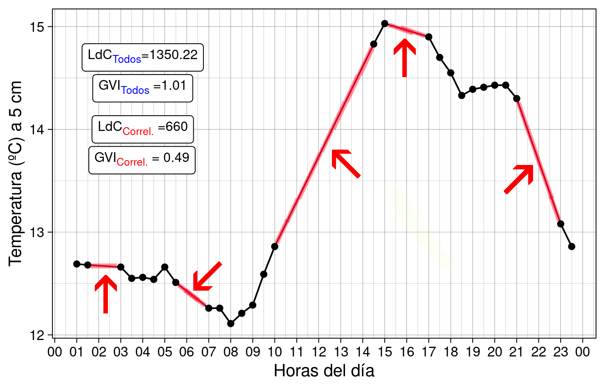

[](https://x.com/?mx=2)

## Finalidad

El objetivo de la función *ldc()* es calcular la longitud de curva; un parámetro útil para conocer la variabilidad de una variable a lo largo del tiempo. Este parámetro está basado en el [GVI (Glycaemic Variability Index) y PGS (Patient Glycaemic Status)](https://bionicwookiee.com/2020/02/26/cgm-metrics-gvi-pgs/) que miden aplicaciones como diabox, para la gestión de la diabetes.

## Información importante
### Cálculos 

La **longitud de curva** (ldc) es el sumatorio de la longitud de los segmentos ($l$) que unen, dos a dos, los puntos ($t_i$, $x_i$)
que conforman la serie temporal de una variable de interés cualquiera ($X$):

$$ldc = \sum_{n=1}^{n} l_i$$

Para calcular esta longitud, se aplica el **Teorema de Pitágoras**:

$$l_i = \sqrt{(t_{i+1}-t_i)^2 + (x_{i+1} - x_i)^2}$$

siendo: 
- $t_i$ el tiempo o momento de medición de la variable de interés.
- $x_i$ el valor de la variable de interés tomada en el momento $t_i$.

Por último, una vez conocido el valor de **ldc**, se divide por la longiud del segmento que une el primer y último registro
de la serie temporal. De esta manera, estandarizamos el valor de ldc y calculamos lo que, de momento, he denominado como GVI:

$$GVI = \frac{ldc}{\sqrt{(t_{n}-t_1)^2 + (x_{n} - x_1)^2}}$$

### Medidas correlativas en el tiempo

La función se ha diseñado para poder decidir **si se incluye o no en el cálculo aquellos segmentos que unen puntos correlativos o no** (argumento *include.all*). Este aspecto es muy importante, pues modifica significativamente el valor de ldc obtenido.

### Paquetes necesarios

Para poder utilizar esta función sin problema, es importante tener instalados los siguientes paquetes: *dplyr* y *tidyr*.

## Argumentos de la función

La función [**ldc()**](https://x.com/?mx=2) admite los siguientes argumentos:

- **col.variable**: un **vector de tipo numérico (entero o flotante)** con la **variable de interés**.
- **col.time**: un **vector de tipo fecha o numérico entero** con la información del **momento de las mediciones**.
- **convert.toDate**: TRUE o FALSE. Para especificar si es necesario transformar la variable de la columna tiempo en formato fecha o ya está en este formato. Por defecto, **FALSE**.
- **format.date**: un **vector de tipo carácter** y de **longitud 1**, donde se especifica el **formato en el que se expresa la fecha**. Los formatos admitidos son los mismos que admite la función *as_datetime()* del paquete *lubridate*.
- **time.measure**: un **vector de tipo numérico** y **longitud 1**. Para especificar el **tiempo entre observaciones/mediciones**.
- **units.time**: un **vector de tipo carácter** y de **longitud 1**. Para especificar las unidades en las que se mide la diferencia de tiempo entre las mediciones, pues la longitud de curva es sensible a las unidades en las que se mide el tiempo (horas, minutos, segundos, días, etc.). Los valores que admite este argumento son: *"secs", "mins", "hours", "days" o "weeks"*.
- **include.all**: TRUE o FALSE. Para especificar si en el cálculo de longitud de curva se desea tener en cuenta todas las observaciones (TRUE) o sólo aquellas que sean correlativas en el tiempo (FALSE). Por defecto, **FALSE**.
- **cal.GVI**: TRUE o FALSE. Para especificar si queremos que la función devuelva el valor de GVI (TRUE) o el de longitud de curva (FALSE). Por defecto, **FALSE**.

```
long.curve <- function(col.variable, 
                col.time,
                convert.toDate = FALSE,
                format.date,
                time.measure,
                units.time,
                include.all = FALSE, 
                cal.GVI = FALSE)
```

## Ejemplos

Los datos con los que trabajaremos en el siguiente ejemplo ([temp_soil.csv](datos_prueba/temp_soil.csv)) han sido cedidos por el [Grupo de Erosión y Conservación De Suelos y Agua](http://www.soilwaterconservation.es/) del [CEBAS-CSIC](http://www.cebas.csic.es/index.html). En ellos se representa la temperatura del suelo a 5 cm de profundidad, medida cada 30 minutos y a lo largo de las 24 h de un día seleccionado al azar.

Copia y pega en la consola de R el siguiente script:
```
# Cargamos librerias, datos y la funcion ----

library(tidyr)
library(dplyr)
library(ggplot2)
library(ggtext)

x <- read.csv("datos_prueba/temp_soil.csv", header = T, sep = ";", dec = ",",
              colClasses = c("character", "numeric", "numeric", "numeric"))

x <- gather(x, key = "depth_level", value = "temp", 2:4)

long.curve <- function(col.variable, 
                       col.time,
                       convert.toDate = FALSE,
                       format.date,
                       time.measure,
                       units.time,
                       include.all = FALSE, 
                       cal.GVI = FALSE){
  # Primer paso ----
  ## Si hace falta, transformar la fecha en el formato deseado
  if(convert.toDate == T){
    col.time <- lubridate::as_datetime(col.time, 
                                       format = format.date)
  }
  
  # Segundo paso ----
  ## Ordenar los datos de más antiguo a más reciente
  if(is.unsorted(col.time)){ # Importante comprobar antes si estan o no ordenados
    indices <- order(col.time) # Ordenamos la variable tiempo y almacenamos los índices en un nuevo vector
    col.time <- col.time[indices] # Actualizamos la variable tiempo
    
    col.variable <- col.variable[indices] # Ordenamos también la variable de interés, para que mantener el dataset inicial
    rm(indices)  
  }
  
  # Tercer paso ----
  ## Determinar si incluimos todos los segmentos en el cálculo o no
  if(include.all == T){
    values <- c()
    indexs <- seq(1, length(col.variable) - 1, 1)
    
    for(i in indexs){
      
      dif.variable <- col.variable[i + 1] - col.variable[i]
      dif.time <- as.numeric(difftime(col.time[i + 1], col.time[i], units = units.time))
      values[i] <- sqrt(dif.time^2 + dif.variable^2)
    }
    longitudCurva <- sum(values, na.rm = T)
    rm(values, dif.variable, dif.time, i)
    
    if(cal.GVI == T){
      dif.variable <- col.variable[length(col.variable)] - col.variable[1]
      dif.time <- as.numeric(difftime(col.time[length(col.time)], col.time[1], units = units.time))
      value <- sqrt(dif.time^2 + dif.variable^2)
      
      longitudCurva/value
    } else {
      longitudCurva
    }
    
  } else {
    values <- c()
    indexs <- seq(1, length(col.variable) - 1, 1)
    
    for(i in indexs){
      dif.time <- as.numeric(difftime(col.time[i + 1], col.time[i], units = units.time))
      
      if(time.measure == dif.time){
        dif.variable <- col.variable[i + 1] - col.variable[i]
        values[i] <- sqrt(dif.time^2 + dif.variable^2)
      } else {
        next
      }
    }
    longitudCurva <- sum(values, na.rm = T)
    rm(values, dif.variable, dif.time, i)
    
    if(cal.GVI == T){
      dif.variable <- col.variable[length(col.variable)] - col.variable[1]
      dif.time <- as.numeric(difftime(col.time[length(col.time)], col.time[1], units = units.time))
      value <- sqrt(dif.time^2 + dif.variable^2)
      
      longitudCurva/value
    } else {
      longitudCurva
    }
  }
}

# Ejemplo ----

x%>%
  group_by(depth_level)%>%
  summarise(lcd = long.curve(col.variable = temp,
                             col.time = Fecha,
                             convert.toDate = F,
                             format.date = "%Y-%m-%d %H:%M:%S",
                             time.measure = 30,
                             units.time = "mins",
                             include.all = T,
                             cal.GVI = T)
            ) -> temp

x%>%
  filter(depth_level == "Prof.1")%>%
  ggplot(aes(x = lubridate::as_datetime(Fecha, format = "%Y-%m-%d %H:%M:%S"), y = temp))+
  geom_point()+
  geom_line(group = 1)+
  annotate(geom = "richtext",
           x = lubridate::as_datetime("25/11/2024 04:00:00",
                                      format = "%d/%m/%Y %H:%M:%S"),
           y = 14.7, label = "LdC<sub><span style='color:blue'>Todos</span></sub>=1350.22",
           size = 3)+
  annotate(geom = "richtext", 
           x = lubridate::as_datetime("25/11/2024 04:00:00", 
                                      format = "%d/%m/%Y %H:%M:%S"),
           y = 14.4, label = "GVI<sub><span style='color:blue'>Todos</span></sub> =1.01",
           size = 3)+
  annotate(geom = "richtext",
           x = lubridate::as_datetime("25/11/2024 04:00:00",
                                      format = "%d/%m/%Y %H:%M:%S"),
           y = 14, label = "LdC<sub><span style='color:red'>Correl.</span></sub> =660",
           size = 3)+
  annotate(geom = "richtext", 
           x = lubridate::as_datetime("25/11/2024 03:58:00", 
                                      format = "%d/%m/%Y %H:%M:%S"),
           y = 13.7, label = "GVI<sub><span style='color:red'>Correl.</span></sub> = 0.49",
           size = 3)+
  labs(x = "Horas del día", y = "Temperatura (ºC) a 5 cm")+
  scale_x_datetime(date_breaks = "hour", 
                   date_labels = "%H") +
  theme_linedraw()

ggsave("datos_prueba/Grafico_ejemplo.png")

```

El gráfico que se obtiene al ejecutar el anterior script es el que aparece a continuación:



Como puedes observar, hay un total de 5 segmentos (marcados en rojo) que unen puntos que no son correlativos en el tiempo. La longitud de curva en el caso de incluir todos los segmentos es de 1350.22. Mientras que si excluimos estos segmentos, el valor es de 660, es decir, aproximadamente la mitad.

También puedes descargar el [dataset](datos_prueba/temp_soil.csv) y el [script](datos_prueba/script_temp_soil.R) con las funciones directamente a tu PC.

¡Espero que os sea de utilidad! :P
